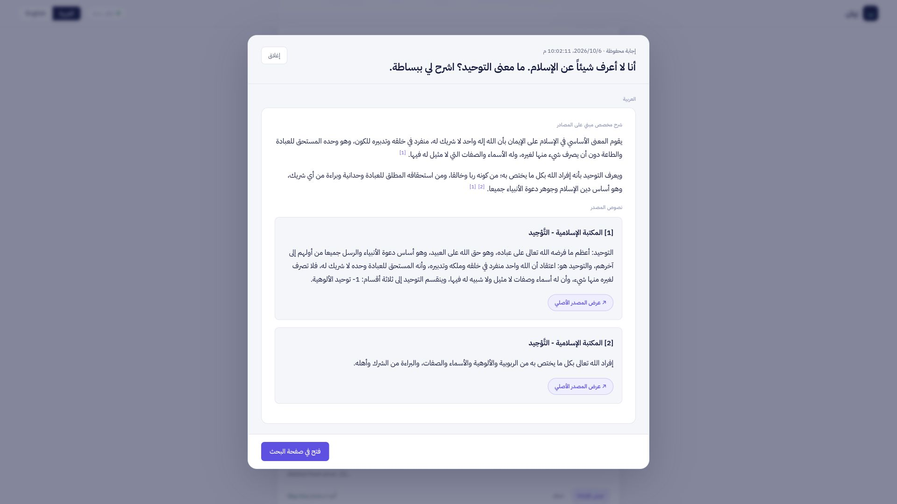

# بَيان · Bayan AI

**Trusted Islamic sources. An explanation shaped for the reader.**

**مصادر إسلامية موثقة، وشرح يناسب السائل.**

Bayan is a Python web application that retrieves accredited Islamic sources, understands the question, and creates a reviewed explanation suited to the reader’s knowledge, language and selected regional context. Published source passages remain separate from AI commentary, with direct citations.

**[Open Bayan · افتح بَيان](https://bayanai.onrender.com/)**

[العربية](#العربية) · [English setup](#english-setup) · [Free hosting](docs/DEPLOYMENT.md) · [Sources and credits](docs/SOURCES_AND_LICENSES.md)



## What Bayan does

- **Knowledge level:** introductory explanations for beginners and deeper explanations for readers with prior knowledge.
- **Regional localization:** adapts the explanation’s starting point to the selected audience while retaining the cited meaning.
- **Multilingual answers:** Arabic; English with Arabic companion; other supported output languages with Arabic and English companions.
- **Evidence review:** retrieves sources, checks relevance and coverage, reviews the explanation and preserves religious terminology.
- **Personal rulings:** refers individual fatwa questions to qualified specialists.
- **History:** saves answers in the current browser, with search and deletion.

## See the product

| Deliverable | File |
|---|---|
| Pitch deck | [PowerPoint](docs/pitch/Bayan_Final_Pitch.pptx) · [PDF](docs/pitch/Bayan_Final_Pitch.pdf) |
| Demo: 1 minute 56 seconds | [Full HD MP4](docs/demo/Bayan_Demo_1080p.mp4) · [Arabic speaking script](docs/demo/SCRIPT.md) |
| Real website evidence | [Screenshots and matrix](docs/evidence/Bayan_Website_Proof.zip) |
| Test explanations | [12-category matrix](docs/evidence/TEST_MATRIX.md) |

The recorded local evaluation on 6 October 2026 passed **12/12 example categories and 41/41 checks**, using 24 unique inputs and previous-answer reuse disabled. This is a recorded local result, not an independent scholarly certification or a guarantee for every question. The video shows real website captures and labelled saved comparisons.

## English setup

### 1. Install

Use **Python 3.12** and Git.

```bash
git clone https://github.com/AbdulhamidObeid/BayanAI.git
cd BayanAI
python3 -m venv .venv
source .venv/bin/activate
python -m pip install --upgrade pip
python -m pip install -r requirements.txt
cp .env.example .env
```

On Windows, use `py -3.12 -m venv .venv`, activate with `.venv\Scripts\Activate.ps1`, and copy with `Copy-Item .env.example .env`.

### 2. Get your Gemini API key

1. Open [Google AI Studio API keys](https://aistudio.google.com/apikey).
2. Sign in, select or create a Google project, and create an API key.
3. Confirm your project can use [Gemini 3.8 Flash](https://ai.google.dev/gemini-api/docs/models/gemini-3.8-flash). Check quota and billing in AI Studio.
4. Open your local `.env` and set:

```dotenv
GEMINI_API_KEY=your_private_key_here
```

The configured model is **`gemini-3.8-flash`**, in `configs/model_routing.json`. Do not publish the key, put it in browser JavaScript or commit `.env`. See Google’s [API-key instructions](https://ai.google.dev/gemini-api/docs/api-key).

### 3. Run

```bash
python -m uvicorn src.web.app:app --host 127.0.0.1 --port 8000
```

Open **http://127.0.0.1:8000/**. The API reference is at `/docs`; the provider connection check is `/api/health`. Select the output language and audience, enter a question and click Send. The first run downloads publisher evidence and builds a private source index; allow time for retrieval and review. Internet access to Google and the approved publishers is required.

Optional: `PYTHONPATH=. python scripts/build_source_index.py` refreshes original publisher passages. Source caches and signing keys are generated locally, not supplied in GitHub. A new installation retrieves evidence afresh.

### 4. Try the three showcases

| Showcase | Question/settings |
|---|---|
| Beginner | `أنا لا أعرف شيئاً عن الإسلام، ما معنى التوحيد؟ اشرح لي ببساطة.` · Arabic · General |
| Prior knowledge | `أعرف معنى التوحيد إجمالاً، فما الفرق بين توحيد الربوبية والألوهية والأسماء والصفات؟` · Arabic · General |
| Region | `ما معنى الدعوة إلى الإسلام، وكيف نفهمها مع مبدأ عدم الإكراه في الدين؟` · Arabic · compare General and Western |
| Multilingual | `لماذا يتجه المسلمون إلى الكعبة في الصلاة؟ هل يعبدون الكعبة؟` · English output |

### 5. Verify

```bash
python -m pip install -r requirements-dev.txt
python -m pytest tests/test_answer_presentation.py tests/test_api_health.py tests/test_query_jobs.py tests/test_terminology_preserver.py -q
```

For the complete evaluation, use `python scripts/evaluate_acceptance.py --mode offline` or `--mode live`. Live evaluation uses real provider calls and quota. Offline tests verify software contracts and do not certify religious correctness. Recorded results belong to their original code/configuration snapshot.

## العربية

بَيان تطبيق ويب يسترجع المصادر الإسلامية المعتمدة، ويحلل السؤال، ثم يقدم شرحاً مراجعاً يناسب مستوى السائل ولغته وسياقه الثقافي. تظهر نصوص المصادر المنشورة مستقلة عن شرح الذكاء الاصطناعي، مع روابط للتحقق.

### التثبيت والتشغيل

1. ثبّت **Python 3.12** وGit.
2. نفّذ أوامر التثبيت الواردة في قسم English setup أعلاه.
3. أنشئ مفتاح API من [Google AI Studio](https://aistudio.google.com/apikey)، وتأكد من إتاحة **Gemini 3.8 Flash** والحصة والفوترة في مشروعك.
4. انسخ `.env.example` إلى `.env`، ثم ضع مفتاحك في `GEMINI_API_KEY`.
5. نفّذ أمر التشغيل أعلاه، وافتح **http://127.0.0.1:8000/**.
6. اختر لغة الإجابة والجمهور، واكتب السؤال، ثم اضغط إرسال. يحتاج التشغيل الأول إلى جلب الأدلة، ويحتاج توليد الإجابة إلى مراجعة المصادر والشرح.

**لا ترفع مفتاح API أو ملف `.env` إلى GitHub.** ضع المفتاح في إعدادات Environment عند الاستضافة. معرّف النموذج الحالي هو `gemini-3.8-flash` في `configs/model_routing.json`.

[دليل الاستضافة المجانية](docs/DEPLOYMENT.md) · [دليل GitHub](docs/GITHUB_GUIDE.md) · [المصادر والتراخيص](docs/SOURCES_AND_LICENSES.md)

## How it works

```text
Question + requested language + chosen region
 → personal-ruling screen and A/B/C/D classification
 → reader-knowledge and question-part analysis
 → retrieval from approved publisher sources
 → evidence relevance and coverage assessment
 → source-bound explanation and separate review
 → terminology checks and unchanged published passages
 → cited answer + browser history
```

## Repository map

| Folder/file | Purpose |
|---|---|
| `src/web/` | FastAPI routes, Arabic/English UI, browser history |
| `src/core/` | Analysis, publisher retrieval, evidence checks, recoverable jobs |
| `src/agents/` | Localized explanation and terminology preservation |
| `configs/` | Source policy, model routes, terminology and presentation rules |
| `scripts/` | Launch, original-source indexing and evaluation commands |
| `tests/` | Software checks and publisher-response fixtures |
| `docs/` | Setup, deployment, sources, deck, video and evidence |
| `render.yaml` | Free Python web-service deployment from `main` |

## Privacy and operation

Browser History stays in that browser until deleted. The server temporarily retains jobs for recovery and completed private results for one hour. Private signing keys, source caches, provider quota records and opt-in sharing receipts are created in `data/private/`, or `BAYAN_PRIVATE_STORE`. Keep these private. Free Render storage is temporary: restarts/redeployments clear server-side records and caches; browser history remains in its browser. Use persistent hosting for long-term server records.

Bayan is an AI source-based information tool; individual religious rulings are referred to specialists. A content fingerprint verifies byte integrity, not religious truth. Published source texts retain their owners’ rights.

## License and credits

Original project code is licensed under [MIT](LICENSE). Publisher content, fonts and dependency licenses are separate; see [Sources and licenses](docs/SOURCES_AND_LICENSES.md). Maintained by [Abdulhamid Obeid](https://github.com/AbdulhamidObeid).
